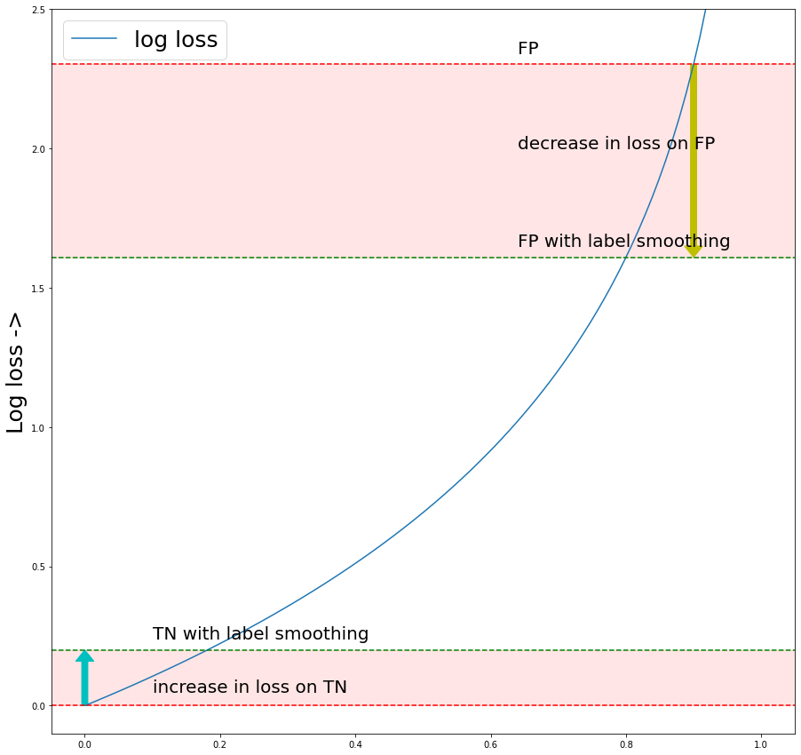

# moa-classification-with-model-blending

[**[View notebooks on NBViewer]**](https://nbviewer.jupyter.org/github/Mayukhdeb/moa-classification-with-model-blending/tree/main/notebooks/)

This repo would contain a cleaner version of the solution to the kaggle [MoA prediction challenge](https://www.kaggle.com/c/lish-moa/) built by me and [mainakdeb](https://github.com/Mainakdeb). It's not complete yet, but there's lots of interesting stuff in there already. 

Will add documentation and explanations after the competition ends.

## List of things that have been working very well

* Feature selection with `VarianceThreshold`
* Label smoothing with dual loss: Using the `LabelSmoothedLoss` for backprop and the normal `nn.BCEWithLogitsLoss()` for early stopping
* "Repeat" layers which is not a real thing, but it works well. It's similar to residual layers with `layer_size = (880,880)`
* Single model, multiple fold preds blending with optuna using OOF preds as a metric for loss 


## What can be done 
* Try and incorporate the old 2nd model with residual layers 
* Use optuna instead of using `lr = 4e-3` and `decay_rate = 0.1` and pray that it works

## Our approach in detail:

### Preprocessing
* Some of the columns in the dataset were not numbers, so we had to map those values to numbers between `0.` and `1.`
* We started off by using `VarianceThreshold` on the columns to determine the columns with the highest variance on all of the train/test features. This gave us 785 columns out of 875. 

### Building model(s)
* We went for the simple shallow NN approach and build 2 pytorch NNs:
    * `Model()` had an input size of `785`, to be trained on the features with a high variance
    * `Model_2()` had an input size of `875`, to be trained on all of the 875 features.

* Both the model's forward functions worked as follows:
    ```python
    def forward(x):

        """
        layer 1
        """
        x1 =  layer1(x)   
        x1_out = relu(x1)

        """
        layer 2
        """
        x2 = layer2(x1_out)
        x2_out = relu(x2 + x1)  ## notice the addition here 

        """
        layer 3 (actually it's layer 2 again)
        """
        x3 = layer2(x2_out)          ## repeated layer2 forward pass
        x3_out = relu(x1 + x2 + x3)  ## notice the addition here 

        """
        output
        """
        x_result = relu(layer3(x3_out))

        return x_result
    ```
    This approach was inspired by the idea of residual layers as a means of reducing overfitting, but we kind of accidentally repeated the `layer2` forward pass. Surprisingly enough, it worked better than the usual residual layer approach. I'm yet to find an explanation for why it works better than the usual residual layers. 
    > please feel free to [get in touch](https://twitter.com/mayukh091) if you know the answer, I really want to know why it worked. 


### Hyperparameter optimization

We optimized the learning rate and the lr decay rate with optuna, with 3 epochs for each fold in each trial. For both the models, the ideal learning came to be around `4e-3` with a decay factor of `0.1` with a patience of `7`. 

### Training

We had to use 2 loss functions within the training loop:

* `LabelSmoothingCrossEntropy()` for backpropagation.
* `nn.BCEWithLogitsLoss()` for early stopping.

#### But why 2 loss functions ?

Multiple sources in the kaggle discussions confirmed that the labels in the training data were **not 100% correct**. Which means there's a high risk of the model learning wrong feature-label mappings while training. And this might lead to highly confident wrong predictions on the test. 

Log loss is known to highly penalize confident wrong predictions, so even one single higly confident wrong prediction could make a deifference in the LB score. The solution to this was **label smoothing**.



With label smoothing, the decrease in loss for False positives (FP) outweights the increase in loss for true negatives (TN). Same goes for TP and FN.

A smoothing factor of `0.2` in `LabelSmoothingCrossEntropy()` meant the prediction would be clipped at `[0.1, 0.9]`

The rest of the things that helped in training are: 
* `ReduceLROnPlateau` reduced the learning rate  by a factor of 0.1 whenever the loss plateaued.
* Weight decay helped in regularization by adding the squared sum of weights multiplied by a `decay_factor` to the loss function.

    * Hence the new loss looked like:
    ```python
    regularized_loss = log_loss + decay_factor*(sum_of_squared_weights)
    ```

**Note**: Both the models were trained on the same exact set of folds. 